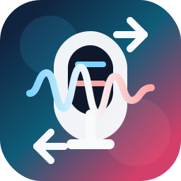

<p align="center">
  
</p>

<h1 align="center">Voice Agent Vn-Jp</h1>

<p align="center">
  A realtime Vietnamese-Japanese voice translation app with an interactive D-ID avatar.
</p>

<p align="center">
  
  
  
  
  
</p>

## Overview

Voice Agent Vn-Jp turns spoken, uploaded, or typed Vietnamese and Japanese into an avatar-led translation experience. The frontend provides the realtime voice UI and D-ID Agent playback, while the backend handles speech recognition, translation, speech synthesis, and public audio URLs.

The app currently focuses on two flows:

- Vietnamese to Japanese translation, then D-ID speaks the translated text.
- Japanese to Vietnamese translation, then Google TTS generates audio for D-ID playback.

## Features

- Switch between Vietnamese to Japanese and Japanese to Vietnamese modes.
- Record from the browser microphone or upload MP3/WAV audio.
- Transcribe speech with Google Speech-to-Text.
- Translate VI and JA content with DeepL.
- Generate Vietnamese speech with Google Text-to-Speech.
- Drive an interactive D-ID Agent through the browser SDK.
- Serve generated audio through a public HTTPS base URL for D-ID.
- Run locally with separate frontend/backend processes or Docker Compose.

## Project Structure

```text
backend/    Express API for translation, STT, TTS, env loading, and audio files
frontend/   React + Vite client for the realtime voice agent UI
docs/       Project notes, deployment guide, and README assets
```

The repository keeps frontend and backend separate because the browser UI, D-ID SDK, Google services, and public audio hosting each have different runtime needs.

## Requirements

- Node.js 20+
- npm
- Google Cloud service account JSON with Speech-to-Text and Text-to-Speech access
- DeepL API key
- D-ID agent ID and client key
- Optional: `cloudflared` for exposing local generated audio to D-ID

## Configuration

Copy the example environment file and fill in your own values:

```bash
cp .env.example .env
```

PowerShell:

```powershell
Copy-Item .env.example .env
```

Important runtime notes:

- `GOOGLE_APPLICATION_CREDENTIALS=./google-credentials.json` is resolved from the folder where the backend process starts.
- If you run the backend from `backend/`, place the credentials file at `backend/google-credentials.json`.
- `PUBLIC_BASE_URL` must be a public HTTPS URL for the Japanese to Vietnamese flow because D-ID needs to fetch generated audio from outside your machine.
- The frontend does not need a separate `.env` for local development; it falls back to `http://127.0.0.1:8081`.

Main environment variables:

| Variable | Purpose |
| --- | --- |
| `PORT` | Backend port, default `8081` |
| `FRONTEND_ORIGIN` / `FRONTEND_ORIGINS` | Allowed browser origins for CORS |
| `GOOGLE_APPLICATION_CREDENTIALS` | Google service account JSON path |
| `GOOGLE_STT_LANGUAGE_CODE` | Default Google STT language |
| `GOOGLE_TTS_LANGUAGE_CODE` | Default Google TTS language |
| `PUBLIC_BASE_URL` | Public HTTPS base URL for generated audio |
| `DEEPL_AUTH_KEY` | DeepL authentication key |
| `DEEPL_SOURCE_LANGUAGE` | Default DeepL source language |
| `DEEPL_TARGET_LANGUAGE` | Default DeepL target language |
| `D_ID_AGENT_ID` | D-ID Agent ID |
| `D_ID_CLIENT_KEY` | D-ID client key |

## Quick Start

Install backend dependencies:

```bash
cd backend
npm install
```

Install frontend dependencies:

```bash
cd frontend
npm install
```

Start the backend:

```bash
cd backend
npm run dev
```

The API starts at:

```text
http://127.0.0.1:8081
```

Start the frontend:

```bash
cd frontend
npm run dev
```

Open the app:

```text
http://127.0.0.1:5174/ver2
```

## Public Audio For D-ID

Use a tunnel when D-ID needs to fetch generated audio from your local backend:

```bash
cloudflared tunnel --url http://127.0.0.1:8081
```

Copy the generated `https://...trycloudflare.com` URL into `PUBLIC_BASE_URL`, then restart the backend.

Do not use `localhost` for `PUBLIC_BASE_URL`. D-ID must receive a public HTTPS URL that it can access directly.

## Docker Compose

Before running Docker Compose:

- Create `.env` in the repository root.
- Put the Google service account JSON at `backend/google-credentials.json`.
- Set `PUBLIC_BASE_URL` to a public HTTPS URL if you use generated audio with D-ID.

Start the stack:

```bash
docker compose up -d --build
```

This starts:

- Backend on host port `8443`
- Frontend on host port `80`

Useful checks:

```bash
docker compose ps
curl http://127.0.0.1:8443/api/health
curl http://127.0.0.1/api/health
```

Open the Docker app:

```text
http://localhost/ver2
```

If you use Cloudflare Tunnel with Docker, point it to the published backend port:

```bash
cloudflared tunnel --url http://127.0.0.1:8443
```

## API

- `GET /api/health` - Health summary and missing config hints.
- `GET /api/embed-config` - D-ID Agent config for the frontend.
- `POST /api/realtime/translate` - DeepL translation.
- `POST /api/realtime/transcribe` - Audio upload and Google STT transcription.
- `POST /api/realtime/synthesize` - Google TTS audio generation and public audio URL.

## Development Commands

Backend:

```bash
npm run dev      # Start Express in watch mode
npm run start    # Start Express normally
npm test         # Placeholder test script
```

Frontend:

```bash
npm run dev      # Start Vite
npm run build    # Build production assets
npm run lint     # Run ESLint
npm run preview  # Preview production build
```

## Troubleshooting

- If D-ID rejects `audio_url`, confirm `PUBLIC_BASE_URL` is public HTTPS and not `localhost`.
- If Google STT or TTS fails, check the service account path and make sure both Google Cloud APIs are enabled.
- If the frontend cannot reach the backend, confirm the API is running on `127.0.0.1:8081` and CORS allows the current origin.
- If Docker Desktop is used to run an image directly, remember that `env_file` and volume mounts from Compose are not applied automatically.

## Status

Voice Agent Vn-Jp is a realtime demo app. The main path is already wired through React, Express, DeepL, Google STT/TTS, and D-ID; the next useful improvements are stronger automated tests, production-friendly frontend serving, and tighter CI/CD for deployment.

## License

This project is released under the [MIT License](LICENSE).
